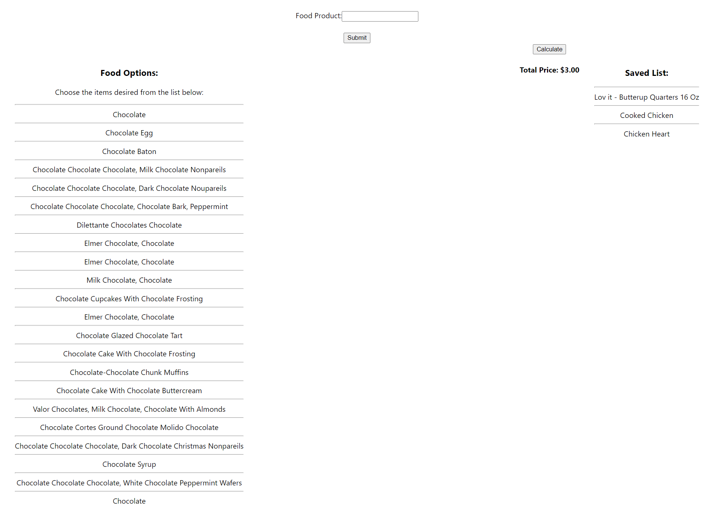

# Food Budget

---
 ## Description
  Food Budget helps select the food you need and calculate the total price.

  ---
 ## Needed Libraries/dependencies
  - axios
  - bootstrap
  - react
  - react-bootstrap
  - react-scripts

  ---
## Installation (Process to Run the Code)
 - Go to the repo at [Food_Budget](https://github.com/Glorvi23/food_budget) 
 - Bring this repo to local machine. 
    - Click on green button labeled 'Code'
    - Copy the SSH key
    - open git bash for Windows/terminal for MAC and type in, `git clone` followed by the SSH code which was copied 
 - Run on Visual Studio Code
    - `code .`
 - You will need to run `npm install` in the terminal. 
 - Once installed, run `npm start`. 
 - Then open a browser and test if the platform is functioning on `localhost:3000`. 
    - Google Chrome works best.

---
  ## Table of Contents
* [Description](#Description)
* [DEMO](#DEMO)
* [Preview](#Preview)
* [Installation](#installation)
* [License](#license)
* [Contributions](#contributions)

---
## DEMO:

## Preview: 

---
## Installation
 - Go to the repo at [Food_Budget](https://github.com/Glorvi23/food_budget) 
 - Bring this repo to local machine. 
    - Fork the repo
    - Click on green button labeled 'Code'
    - Copy the SSH key
    - open git bash for Windows/terminal for MAC and type in, `git clone` followed by the SSH code which was copied 
 - Run on Visual Studio Code and open a terminal. 
    - `code .`
 - Once terminal is open, you will need run `npm install` in the terminal. 
 - Once installed, run `npm start`. 
 - Then open a browser and test if the platform is functioning on `localhost:3000`. 
    - Google Chrome works best.

---

## License  

Copyright 2021
Permission is hereby granted, free of charge, to any person obtaining a copy of this software and associated documentation files (the "Software"), to deal in the Software without restriction, including without limitation the rights to use, copy, modify, merge, publish, distribute, sublicense, and/or sell copies of the Software, and to permit persons to whom the Software is furnished to do so, subject to the following conditions:
The above copyright notice and this permission notice shall be included in all copies or substantial portions of the Software.
THE SOFTWARE IS PROVIDED "AS IS", WITHOUT WARRANTY OF ANY KIND, EXPRESS OR IMPLIED, INCLUDING BUT NOT LIMITED TO THE WARRANTIES OF MERCHANTABILITY, FITNESS FOR A PARTICULAR PURPOSE AND NONINFRINGEMENT. IN NO EVENT SHALL THE AUTHORS OR COPYRIGHT HOLDERS BE LIABLE FOR ANY CLAIM, DAMAGES OR OTHER LIABILITY, WHETHER IN AN ACTION OF CONTRACT, TORT OR OTHERWISE, ARISING FROM, OUT OF OR IN CONNECTION WITH THE SOFTWARE OR THE USE OR OTHER DEALINGS IN THE SOFTWARE.

---
## Contributions
- [Caleb Glorvigen](https://github.com/Glorvi23)

---

 *Please use Google Chrome browser*
